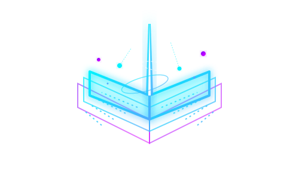

<div align="center">
  
  <h1>📚 Booker</h1>
  <p><b>Automated Literary Intelligence & Narrative Forensics</b></p>
  
  <a href="https://github.com/8lianno/booker"></a>
  <a href="https://github.com/8lianno/booker"></a>
  <a href="https://github.com/8lianno/booker"></a>
  <a href="https://github.com/8lianno/booker"></a>
</div>

<br/>

**Booker** is an automated narrative intelligence pipeline. It turns raw EPUBs into **verified, high-yield dossiers**—stripping away the fluff to extract pure plot mechanics, character arcs, thematic DNA, and actionable frameworks in a fraction of the reading time.

Whether it's non-fiction strategic insights or fiction plot forensics, Booker synthesizes the core narrative into beautifully formatted, 15k+ word documents complete with source-anchors and recall quizzes.

---

## ⚡ Features

- 🧠 **Dual Analytical Engines:** Custom processors for both **Fiction** (plot mechanics, worldbuilding, act structures) and **Non-Fiction** (mental models, actionable insights, frameworks).
- 🚀 **NotebookLM Integration:** Bypasses context limits and read timeouts by employing chunked batch processing directly against the NotebookLM API.
- 🎨 **Multi-Format Export:** Generates clean, typography-focused `.epub` for e-readers, `.pdf` for print, `.html` for web, and raw `.md`.
- 🔎 **Source Anchoring:** Extracts verifiable insights, automatically anchoring claims down to the exact chapter and paragraph.
- 🚫 **No AI Fluff:** Strict parsing rules completely ban "conversational filler" and "chatty AI" artifacts. You get pure narrative data.

## 🛠️ Usage

Works seamlessly with any coding-agent CLI (Claude Code, Google Antigravity, Kimi Code). The pipeline relies entirely on Python scripts and markdown workflows with local state.

### Generating a New Dossier
```bash
python3 booker.py new --title "the count of monte cristo"   # Fetches from local Calibre library
python3 booker.py new /path/to/book.epub                    # Or specify a direct path
```

### Rendering & Status
```bash
python3 booker.py status <slug>                             # View processing state and next steps
python3 booker.py render <slug>                             # Generate EPUB, HTML, and PDF exports
python3 booker.py index                                     # Update the README index
```

## 📁 Output Structure

Dossiers are saved in the `books/<slug>/` directory. A complete synthesis produces:
- `dossier.md` (Raw source Markdown)
- `dossier.epub` (Beautifully justified for e-readers)
- `dossier.pdf` (Print-ready document)
- `dossier.html` (Web view with unobtrusive hover markers)
- `recall.md` (Spaced-repetition recall quiz)
- `verification.json` (Coverage, claim-support audit, and scoring)

---


## ⚙️ How It Works (The Pipeline)

```mermaid
flowchart TD
    %% Node Styles
    classDef input fill:#3b82f6,stroke:#fff,stroke-width:2px,color:#fff;
    classDef process fill:#475569,stroke:#fff,stroke-width:2px,color:#fff;
    classDef ai fill:#10b981,stroke:#fff,stroke-width:2px,color:#fff;
    classDef output fill:#8b5cf6,stroke:#fff,stroke-width:2px,color:#fff;

    A([📚 1. Input Book]) :::input --> B(✂️ 2. Extract & Chunk) :::process
    B -->|Send Text Chunks| C{🤖 3. NotebookLM AI} :::ai
    
    C -.->|If Fiction| D[Plot, Characters & Lore] :::ai
    C -.->|If Non-Fiction| E[Mental Models & Tactics] :::ai
    
    D --> F(📝 4. Build Master Dossier) :::process
    E --> F
    
    F --> G(🔎 5. Verify & Score) :::process
    G -->|Generate Files| H([✨ 6. Final EPUB / PDF / HTML]) :::output
```

1. **Input**: You provide a raw EPUB book.
2. **Extract & Chunk**: Booker breaks the book down into small, numbered chapters to make it easy for the AI to digest.
3. **AI Analysis**: The text is sent to NotebookLM in small batches. The AI reads the book and extracts the most important information depending on whether it's Fiction or Non-Fiction.
4. **Build Master Dossier**: All the extracted insights are combined into one massive, highly organized Markdown document.
5. **Verify & Score**: Booker audits the dossier to ensure everything is accurate and anchored to the source text, giving it a quality badge score.
6. **Final Export**: The raw text is beautifully formatted into EPUB, PDF, and HTML files for you to read anywhere!

<div align="center">
  <sub>Built for precision reading and narrative extraction.</sub>
</div>
